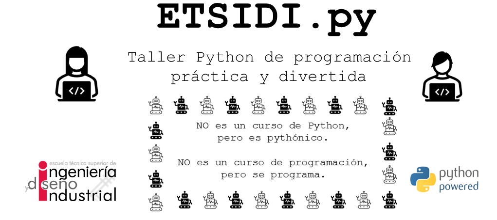

| Plataforma  | Pizarra |
| ----------- | ----------- |
| [Google Colab](https://colab.research.google.com/) para las lecciones| [Board](https://board.net/p/etsidi.py) para compartir código|

# ETSIDI.py

## Instrucciones pre-taller
1. Crear repositorio para el proyecto, p. ej. en [GitHub](https://github.com/) o cualquier otro en el que te sientas cómodo.
2. Instalar un cliente git, p. ej. [GitHub Desktop](https://desktop.github.com/) o cualquier otro en el que te sientas cómodo.
3. Instalar entorno Python mediante [miniconda](https://github.com/isi-ies-group/python-info#miniconda) o cualquier otro en el que te sientas cómodo.
4. Instalar algún IDE, p. ej. [Spyder](https://github.com/isi-ies-group/python-info#ide---spyder) o cualquier otro en el que te sientas cómodo.

## Recursos taller

1. [First steps - Real Python](https://realpython.com/python-first-steps/)
2. [Tutorial - Learn Python in 10 minutes](https://www.stavros.io/tutorials/python/)
3. [Python for C programmers](https://engineering.purdue.edu/~milind/datascience/2018spring/notes/lecture-2.pdf)
4. Información varia https://github.com/isi-ies-group/python-info

## Ejemplos proyectos
1. https://www.seraph.to/python-wikipedia-2019.html#python-wikipedia-2019%20#Wikipedia%20#API%20#Python
2. Varios libros con proyectitos interesantes (gratuitos) https://inventwithpython.com/#automate
3. https://programacionpython80889555.wordpress.com/2021/05/04/obteniendo-posicion-de-la-iss-en-tiempo-real-con-python-e-iss-info/
    * https://api.nasa.gov/
4. https://github.com/python-telegram-bot/python-telegram-bot
5. http://norvig.com/sudoku.html
6. https://github.com/geekcomputers/Python
7. [Web estacion meteo IES](https://helios.ies.upm.es/)
8. Rellena hojas horas investigador UPM
9. [Reparte grupos laboratorio ETSIDI]()

## Recursos implantación
1. [Heroku - ejemplo Flask](https://realpython.com/flask-by-example-part-1-project-setup/)
2. Streamlit
3. [AWS](https://realpython.com/python-boto3-aws-s3/)
